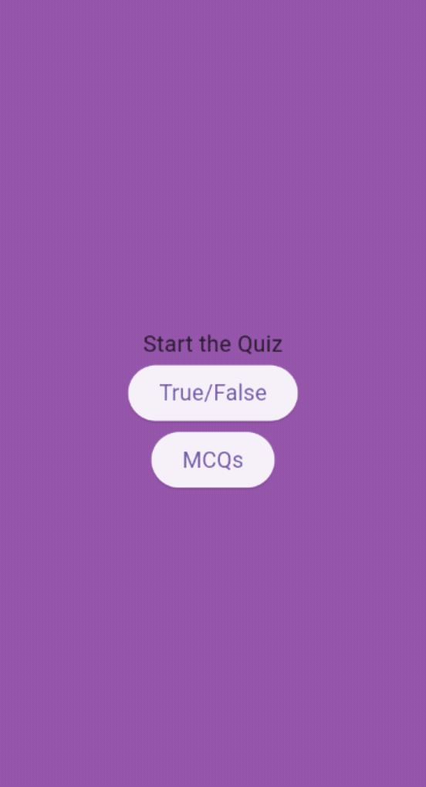
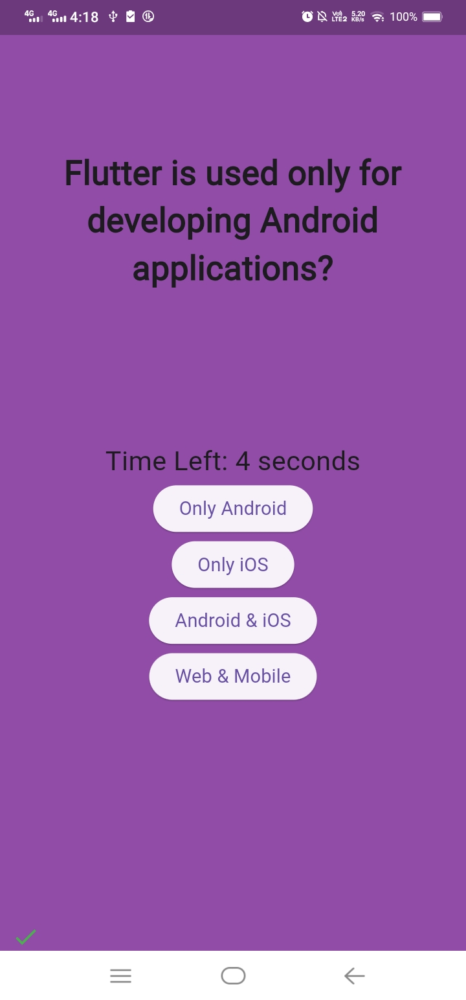
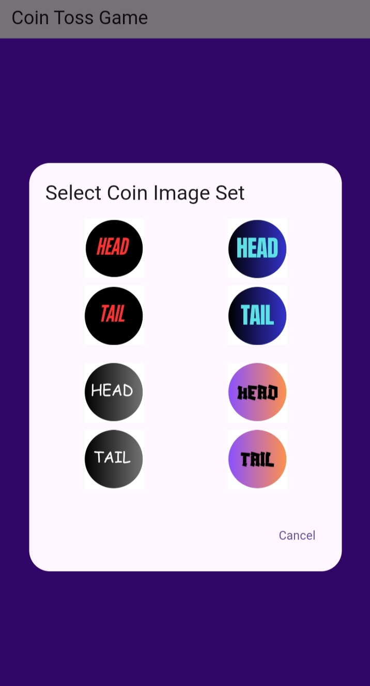
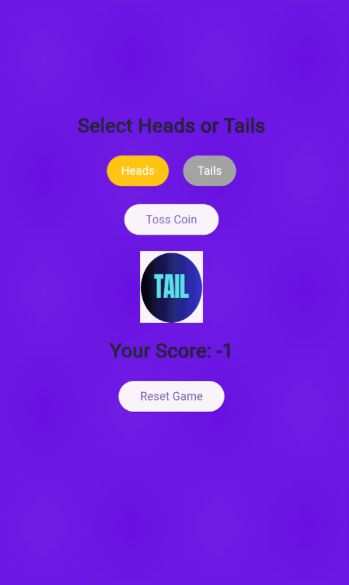
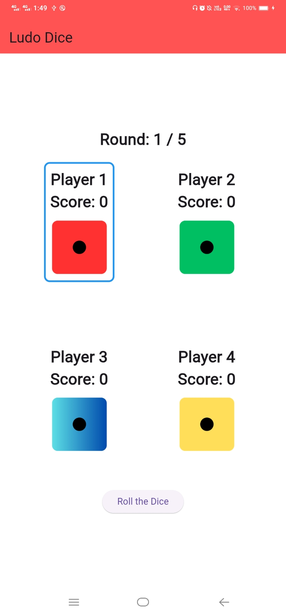

# Beginner-Level Flutter Apps

Welcome to this collection of beginner-friendly Flutter apps! 🚀 These projects are perfect for those looking to enhance their Flutter skills while building fun and interactive applications. Below, you'll find a list of projects along with screenshots showcasing their UI and functionality.

---

## 📸 Screenshots

<div align="center">

### 🎯 Spin Bottle  
A fun spin-the-bottle game.  


---

### 🔢 Calculator  
A simple yet functional calculator app.  


---

### 🧠 Quiz 2.0  
An interactive quiz game with animations.  

<table>
  <tr>
    <td></td>
    <td></td>
  </tr>
  <tr>
    <td></td>
    <td></td>
  </tr>
</table>

---

### 🪙 Coin Flip  
A simple coin-flipping app with animations.  

<table>
  <tr>
    <td></td>
    <td></td>
    <td></td>
  </tr>
</table>

---

### 🎲 Ludo Dice  
A dice roller for Ludo and board games.  

<table>
  <tr>
    <td></td>
    <td></td>
    <td></td>
  </tr>
</table>

---

### 🎵 Xylophone  
A musical app that plays xylophone sounds.  

<table>
  <tr>
    <td></td>
    <td></td>
    <td></td>
  </tr>
</table>

</div>

---

### 📌 How to Run
1. Clone the repository:
   ```sh
   git clone https://github.com/your-repo/flutter-apps.git
   ```
2. Navigate to the project folder:
   ```sh
   cd project-folder
   ```
3. Get dependencies:
   ```sh
   flutter pub get
   ```
4. Run the app:
   ```sh
   flutter run
   ```

---

🌟 **Happy Coding!** 🎉

